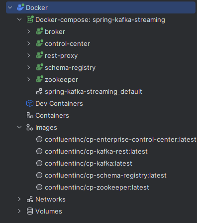
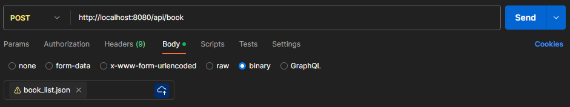
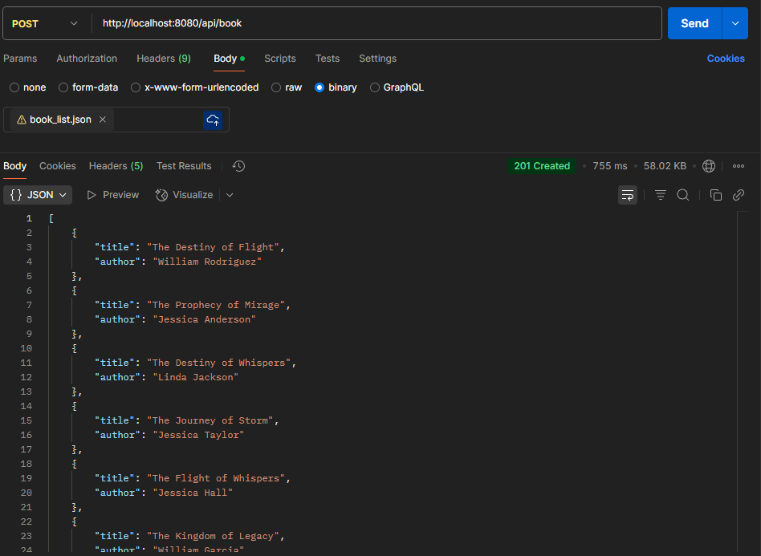
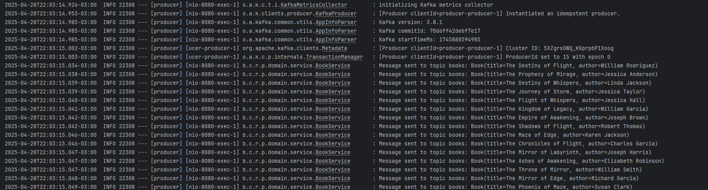
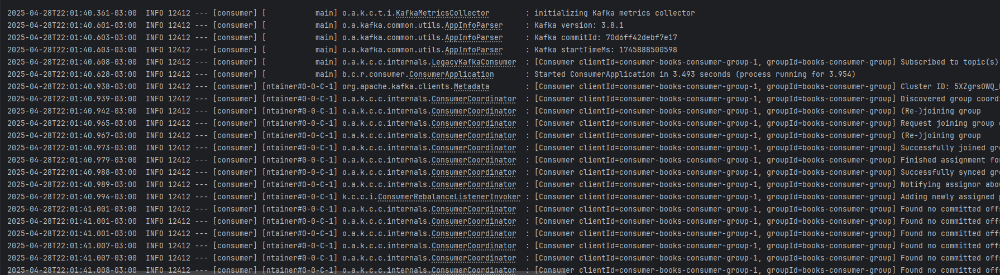
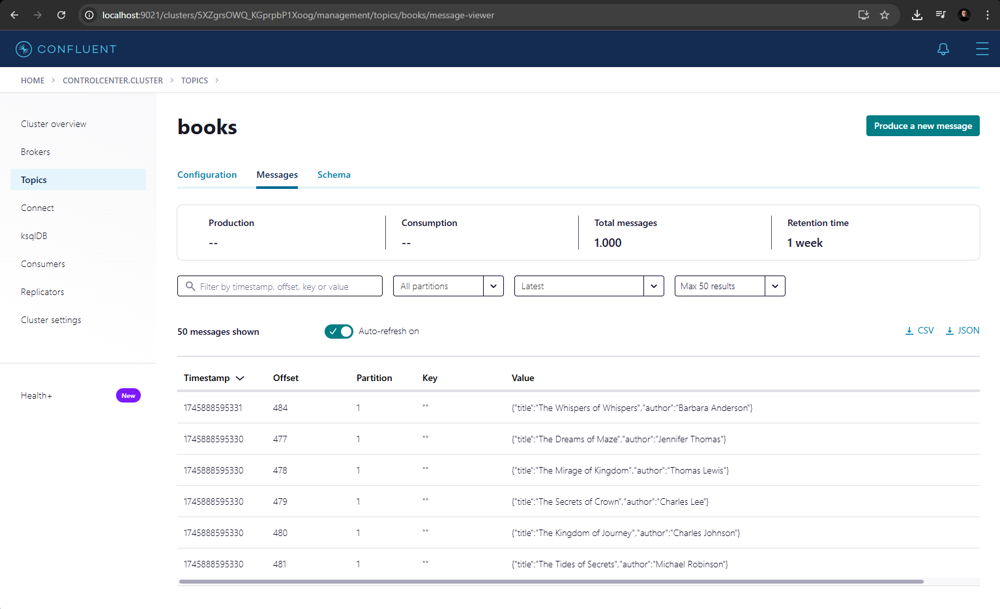

## Kafka streaming with Spring Boot

## Technologies
- Java
- Spring Boot
- Spring Kafka
- Docker
- Hexagonal Architecture

## Stack
- Zookeeper
  - Image: latest
  - Ports: 2181
- Broker
  - Image: latest
  - Ports: 29092, 9092, 9091
- Schema-registry
  - Image: latest
  - Ports: 8081
- Rest-proxy
  - Image: latest
  - Ports: 8082
- Control-center
  - Image: latest
  - Ports: 9021

## Usage
1. Clone the repository
2. Start the Stack using Docker
   ```bash
   docker-compose up -d
   ```
3. Build Java the application (Producer and Consumer)
4. Send a request to the application
   ```bash
   curl -X GET http://localhost:8080/api/book
   ```
## Docker Images and Containers


## Use file in Postman


## Request Post Message


## Producer Log


## Consumer Log


## Confluent Control Center
